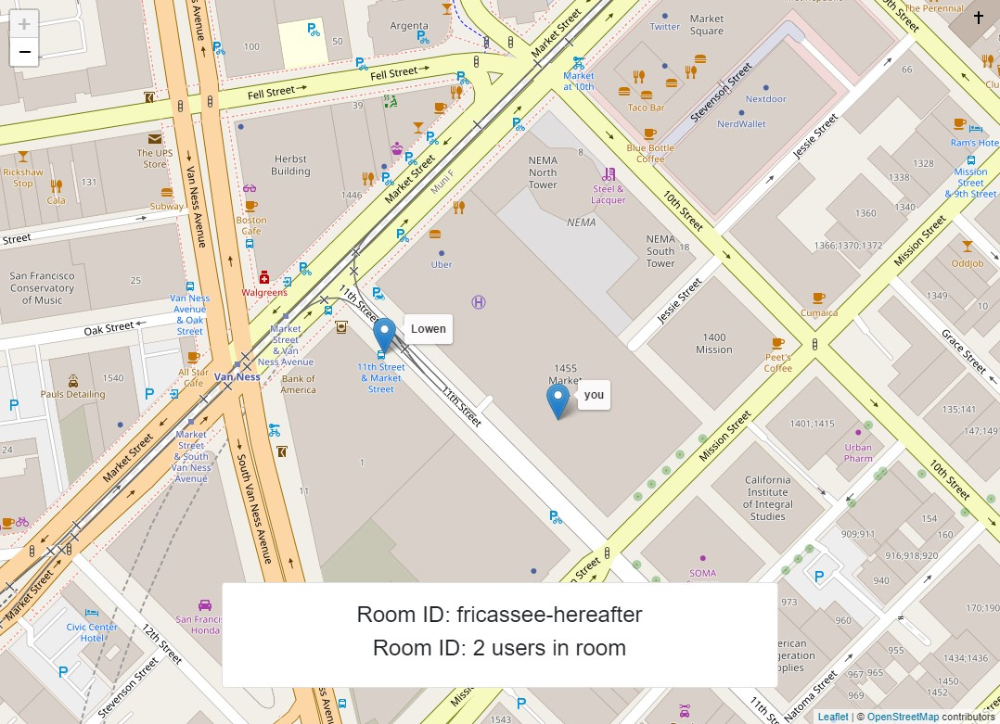

# Demo Location Sharing Application 📍



## About
A location-sharing application that allows users to create and join rooms where they can share their live locations.

The application is built to demonstrate the following:

-   [The Browser Geolocation API](https://developer.mozilla.org/en-US/docs/Web/API/Geolocation_API) to retrieve the user device's current location
-   [leaflet.js](https://leafletjs.com/) on the client-side to display maps and markers
-   The WebSockets protocol, the browser WebSockets API and the node.js WebSockets library for real-time communication


## Features

-   Rooms where users can share their location information
-   Creating / Joining rooms
-   Shareable room passphrases
-   Live updates of user locations

## Deployment

A [Heroku](https://www.heroku.com) account and the [Heroku CLI](https://devcenter.heroku.com/articles/heroku-cli) is needed to deploy this application to Heroku. Docker is also required.

Log in to container registry
```console
$ heroku container:login
```

If you want to create a new Heroku app to deploy to, navigate to the app’s directory and create a Heroku app:
```console
$ heroku create
```

Alternatively, if there is already a Heroku app you want to add this to, add the remote to the repository:
```console
$ heroku git:remote -a your-app-name
```

Build the image and push to Container Registry:
```console
$ heroku container:push web
```

Then release the image to your app:
```console
$ heroku container:release web
```


[IAP notes on deployment to Heroku](https://realtime-apps-iap.github.io/docs/introduction/deployment-to-heroku)

[Article on deploying docker images to Heroku](https://devcenter.heroku.com/articles/container-registry-and-runtime)
